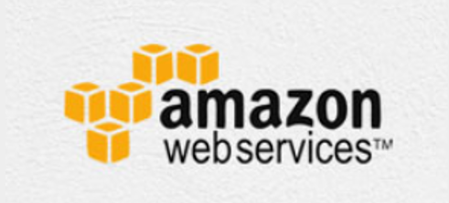

# Amazon Web Services - Cloud Computing

Primero empecemos con saber que es el “Cloud Computing”. Cloud Computing “La computación en la nube” es un servicio de computación 
a través de una red, que usualmente es internet. Al usar la computación de la nube, las organizaciones pueden usar recursos y 
almacenamiento en lugar de construir por su propia cuenta.

En el año 2006 AWS (Amazon web services) empezó a ofrecer sus servicios de TI, pero dirán ustedes que es el TI, bueno, es la 
aplicación de los ordenadores y equipos de telecomunicación para almacenar, recuperar, transmitir y manipular datos en el 
ámbito de los negocios o de las empresas. Con este servicio que no se necesita planificar servidores, óseas infraestructuras.
Ya que al implementar este tipo de servicios requiere mucho tiempo por adelantado. Por eso es que AWS permite activar 
instantáneamente cientos o miles de servicios en minutos y entregar más rápido. Lo asombrante de utilizar este servicio 
de TI es que solo pagamos lo que vamos a usar, sin gastos iniciales ni compromisos de largo plazo, entonces podemos mencionar
que AWS es un servicio muy rentable para aquellas personas que desean adquirirlo.  

Entendiendo que AWS brinda un servicio computacional en la nube. Podemos reconocer que las características que brinda dicho
servicio son como; aprovisionar y liberar recursos a pedidos, se puede ampliar o disminuir automáticamente la carga, se puede
acceder de manera seguro a los recursos.

## Tipos de nubes

Existen tres diferentes tipos de nubes: publicas privada y de tipo hibridas.

### Nube publica

este tipo de nube, los proveedores de servicios externos ponen a disponibilidad a todos sus clientes recursos y servicios a
través de internet. El cliente puede almacenar sus datos y su seguridad estará relacionada con la infraestructura de los 
proveedores de servicios.

### Nube privada

En este tipo de nube, también brindan las mismas características de la nube publica, pero los datos y los servicios del 
cliente son administrados por la organización o por un tercero solo para la organización del mismo cliente. Este tipo minimiza
los problemas relacionados con la seguridad.

### Nube hibrida

este tipo de nube, es la combinación de la nube publica y la nube privada. Depende a la decisión de ejecutarse a una nube 
publica o privada, varios parámetros como que tan delicado sea los datos y aplicaciones del cliente.

## Modelos de servicios de la nube

existen tres tipos de modelos de servicios en la nube, IaaS, PaaS y SaaS.

IaaS: Infraestructura como servicio (Infrastructure as a service). Es una infraestructura informática instantánea, aprovisiona
da y administrada a través de Internet. Es uno de los cuatro tipos de servicios en la nube, junto con software como servicio 
(SaaS), plataforma como servicio (PaaS) y sin servidor.

SaaS: El software como servicio permite a los usuarios conectarse a aplicaciones basadas en la nube a través de Internet y 
usarlas. Algunos ejemplos comunes son el correo electrónico, los calendarios y las herramientas ofimáticas. 

PaaS: es un conjunto de servicios basados en la nube que permite a los desarrolladores y usuarios empresariales crear 
aplicaciones a una velocidad que las soluciones en las instalaciones no pueden alcanzar. Al tratarse de un servicio basado en
la nube, no hay necesidad de preocuparse por la configuración y el mantenimiento de servidores, parches, actualizaciones y 
autenticaciones, entre muchas otras tareas: los usuarios pueden centrarse en crear la mejor experiencia de usuario posible.

## Desventajas de la computación en la nube

Aunque Cloud Computing ofrece un conjunto maravilloso de ventajas, también tiene algunos inconvenientes que a menudo generan
dudas sobre su eficiencia.

En el ámbito de seguridad, es un problema porque los proveedores del servicio, el almacenamiento de datos y archivos 
importantes en proveedores de servicios externos conlleva un riesgo. Los problemas técnicos del servicio de nubes como 
brindan sus servicios a muchos clientes cada día, puede llegar a tener muchos problemas de conexión al sistema o estar 
suspendido por alta demanda de uso. No es fácil cambiar de proveedor de servicios La mayoría de las organizaciones pueden 
tener dificultades para alojar e integrar las aplicaciones actuales de la nube en otra plataforma 

