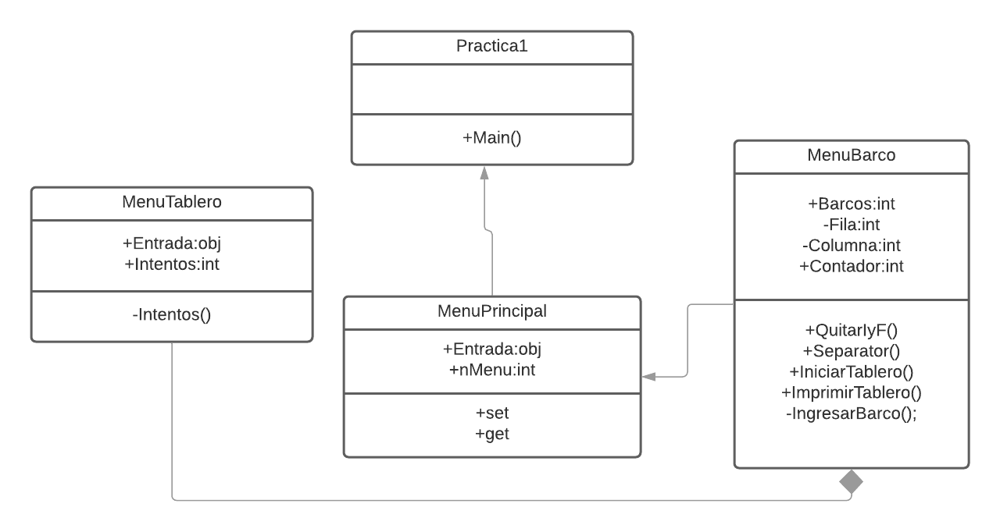

# Practica 1 

BattleShip el cual consiste en desplegar una flota de barcos en un
tablero de 10 filas x 10 columnas, y un contrincante disparará misiles en determinadas coordenadas
para intentar adivinar la posición de alguno de los barcos de la flota. Si logra acertar en una parte de
algún barco lo hunde por completo.

## Requerimientos de la aplicacion

### Minimos

Procesador:  Core i3 de 1.5 Ghz.
Memoria RAM: 512 MB.
Windows 7 de 64 bits

### Recomendados 

Procesador: Core i5 de 2,4 GHz
Memoria RAM: 4 GB de RAM
Windows 8/10 de 64 bits

## Diagrama de clases

## Metodos utilizados

El programa cuenta con 4 clases:
1. Practica1: se encuentra el main y esta instanciada la clase de MenuPrincipal
2. MenuPrincipal: se encuentra instanciada la clase de MenuTablero y 
3.MenuTablero: se encuentra instanciada la clase de MenuBarcos y cuenta un un metodo para cambiar los intentos.
4.MenuBarcos: Cuenta con varios metodos, DameCoo el que nos permite separar un string de la ",", un metodo 
QuitarIyF el cual nos elimina los parencesis de las coordenadas ingresadas, metodo para ingresar los 9
diferentes barcos que contamos, el cual lo ordena en la matriz que se realiza con el metodo de imprimirTablero().

## Logica

El enuncido nos indica que los las coordenadas eran (fila inicio, columna inicio)-(fila fin , columna fin) basada en esta
parte del enunciado empece a redactar que necesitaba tener un vector para colocar los split el cual separaba las coordenadas ingresadas
por el usuario, par aluego poder imprimir el barco en el tablero, para luego darle un metodo de juego el cual usuuario cuenta con 10 intentos para
poder derivar a dichos barcos, y cuando el usuario por coordenadas ingresadas derive al barco y lo hunde por completo.

