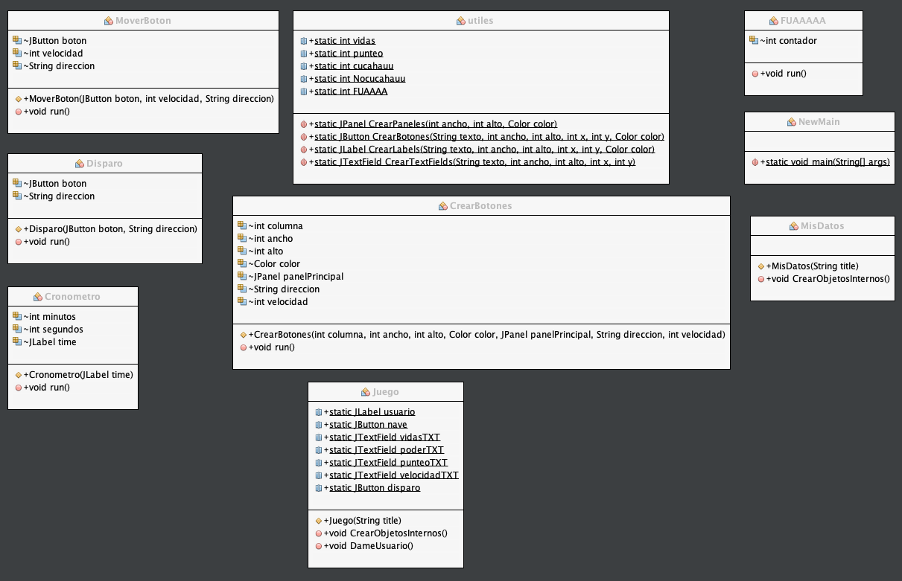

# Practica 2 

GALAGA consiste en desruir los asteroides que estan apareciendo
en el tablero, pero no solo consta de asteroides, sino que 
tambien de vidas los cuales les incrementan si en dado caso 
has perdido una vida al colicionar con un asteroide, un rayo,
el que permite que te muevas mas rapido en el tabler.

## Requerimientos de la aplicacion

### Minimos

Procesador:  Core i3 de 1.5 Ghz.
Memoria RAM: 512 MB.
Windows 7 de 64 bits

### Recomendados 

Procesador: Core i5 de 2,4 GHz
Memoria RAM: 4 GB de RAM
Windows 8/10 de 64 bits

## Diagrama de clases

## Metodos utilizados

Cuenta con 4 paquetes el cual estan divididos por interfaces,
clases, procesos y el main. 
el paquete procesos cuenta con 5 clases, el que crea botones
el que crea el cronometro, el que crea el disparo de la nave
la clase del poder de la nave y el que mueve el boton, cabe 
mencionar que en este paquete cuenta con metodos muy importantes
para que el juego funcione, cada clase cuanta con una herencia de
Thread el cual sobrescribe el metodo Run(), el cual me permite
dormir cada cierto tiempo la creacion de botones, el seguimiento del
cronometro, etc...
en el paquete de Tablero contamos con interfaces, el del tablero del 
juego, el del menu, y el de los creditos. el metodo mas importante
es el de creaciondeonjetos() el cual inserta los jlabels, jbutton el jpanel
al jframe.
el paquete de clases cuenta con una clase que es usuario,
el que almacena los datos del usuario que esta jugando.

## Logica

Empezar con enteder hilos (Threads) para crearlos sincronizados, y poder
imprimir en el tablero cierta cantidad de tiempo el mismo objeto tipo boton
ya sea para el asteroide, caracol o vidas.

