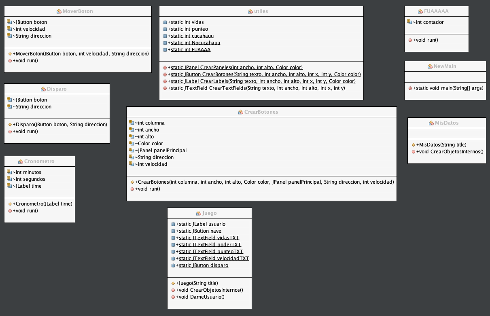

# PROYECTO 2

Recoger Bloques, consiste en un tablero de 5 filas y 7 columnas, donde nuestro 
bloque el cual se va a recorrer en todo el tablero recogiendo diferentes 
bloques de colores que se cargaran con un JFileChooser para sumar puntos y colocarlos
en las distintas estructuras de datos.	

## Requerimientos de la aplicacion

### Minimos

Procesador:  Core i3 de 1.5 Ghz.
Memoria RAM: 512 MB.
Windows 7 de 64 bits

### Recomendados 

Procesador: Core i5 de 2,4 GHz
Memoria RAM: 4 GB de RAM
Windows 8/10 de 64 bits

## Diagrama de clases

## Metodos utilizados

El programa consta consta con 7 diferentes interfaces, en las cuales podemos mencionar las mas importantes
como el tablero y las estructuras de datos donde se podran agregar y eliminar nodos.
el tablero principal consta de metodos importantes, como, AbrirArchivo, quien es el encargado de instanciar
un objeto de tipo JFilechooser y lo almacena en un vector para luego hacer uso el metodo de HacerloVector
quien divide el texto por comas y lo va insertando en la lista simple.
tambien cuenta con el addBoton, quien agrega el tablero de botones con el cual vamos a jugar.
tambien podemos mencionar los metos importantes que cuenta cada estructura de datos. es decir cada metodo que
tiene nustras listas, como el metodo de agregar(): es el que inserta los nodos a la lista, el de Eliminar() es el que
se encarga de recorrer la lista usando un parametro para eliminar el nodo segun su posicion o su valor,
y los metodos que imprimen en graphiz quienes se encargan en mostrar en un JTextArea una sintaxys de graphiz segun el 
tipo de lista que tengamos.
 

## Logica

El almacenamiento de datos cargados por el FileChooser, me todo la idea de crear varios metodos para que se pudiera dividir
como el el plantamiento cuanta con diferentes cargas ya se con la fila la columna el valor y el color, entonces un metodo que
dividiera el espacio y que dividiera la coma, tambien el uso de ir juntando nodos para poder hacer usos de ver el tamanio de 
de nustras diferentes listas.

